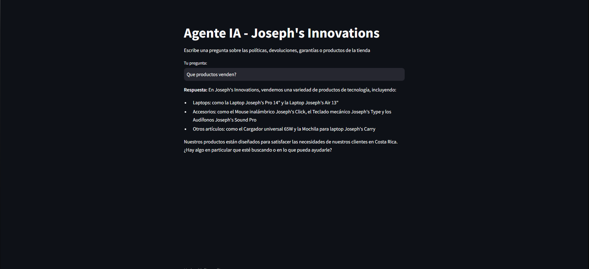
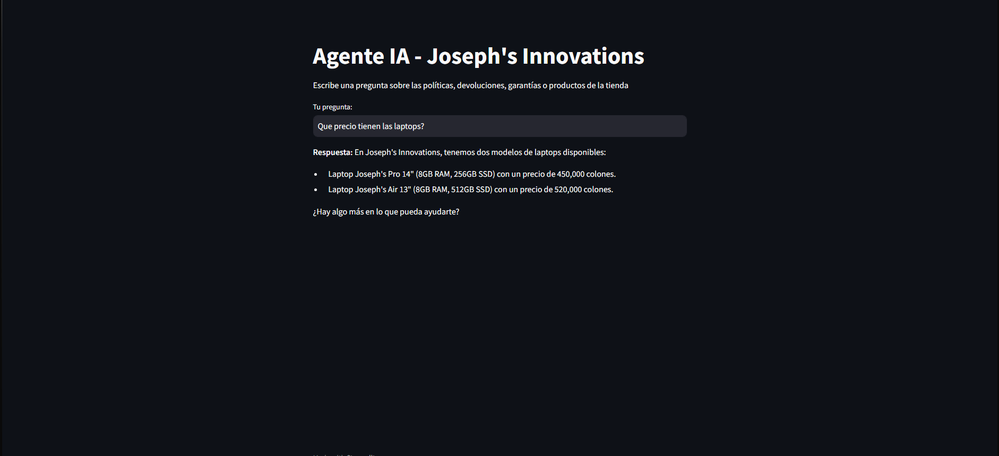
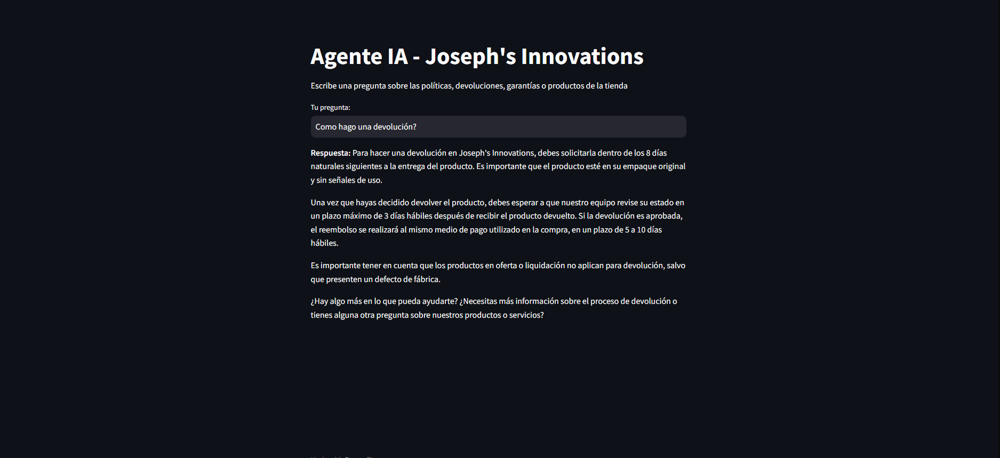
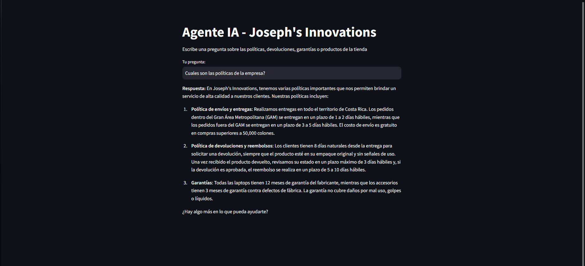

# Agente IA - Joseph's Innovations

Proyecto final del programa **ONE AI FOR TECH** (Alura Latam + Oracle). Un agente de inteligencia artificial que responde preguntas sobre las políticas, productos, devoluciones y garantías de Joseph's Innovations, una tienda en línea ficticia de tecnología, usando como única fuente de información un documento PDF.

## Descripción del proyecto

El agente lee un documento PDF con las políticas internas de la empresa (envíos, devoluciones, garantías, métodos de pago, catálogo de productos) y responde preguntas en lenguaje natural basándose únicamente en ese contenido. No necesita que el usuario abra ni busque dentro del documento — solo escribe su pregunta y recibe una respuesta directa.

El proyecto tiene dos formas de uso:
- **Por terminal** (`agente.py`): para pruebas rápidas y desarrollo.
- **Por interfaz web** (`interfaz.py`): una página simple hecha con Streamlit donde cualquier persona puede escribir su pregunta.

## Arquitectura de la solución
```text
Usuario
   |
   v
Interfaz (Streamlit) o terminal (agente.py)
   |
   v
Lectura del PDF (pypdf) -> se extrae todo el texto del documento
   |
   v
El texto se envia como contexto al modelo, junto con la pregunta
   |
   v
Modelo de lenguaje (Llama 3.3 70B, via API de Groq, con LangChain)
   |
   v
Respuesta en lenguaje natural, basada solo en el documento
```
Decidí pasar el texto completo del PDF como contexto al modelo en cada pregunta, en vez de usar una base de datos vectorial (embeddings), porque eso todavía no lo he estudiado. Para un documento de este tamaño funciona bien.

## Tecnologías utilizadas

- **Python 3** — lenguaje principal del proyecto
- **LangChain + langchain-groq** — para conectar con el modelo de lenguaje
- **Groq API (modelo Llama 3.3 70B)** — el modelo que genera las respuestas
- **pypdf** — lectura y extracción de texto del documento PDF
- **Streamlit** — interfaz web del agente
- **python-dotenv** — manejo seguro de la clave API
- **Git / GitHub** — control de versiones
- **Oracle Cloud Infrastructure (OCI)** — instancia de cómputo donde está desplegada la aplicación
- **systemd** — para que la aplicación se mantenga corriendo de forma permanente en el servidor

## Instalación y ejecución local

1. Clonar el repositorio
```bash
git clone https://github.com/josephmoram/AgenteIA.git
cd AgenteIA
```

2. Crear y activar entorno virtual
```bash
python -m venv venv
venv\Scripts\activate
```

3. Instalar dependencias
```bash
pip install -r requisitos.txt
```

4. Crear archivo `.env` con tu clave de Groq
```
GROQ_API_KEY=tu_clave_aqui
```

5. Ejecutar el agente por terminal
```bash
python agente.py
```

6. O ejecutar la interfaz web
```bash
streamlit run interfaz.py
```
La interfaz se abre en `http://localhost:8501`

## Ejemplos de preguntas y respuestas

**Pregunta:** ¿Qué productos venden?

**Respuesta:** En Joseph's Innovations, vendemos una variedad de productos de tecnología, incluyendo: Laptops como la Laptop Joseph's Pro 14" y la Laptop Joseph's Air 13"; Accesorios como el Mouse inalámbrico Joseph's Click, el Teclado mecánico Joseph's Type y los Audífonos Joseph's Sound Pro; y otros artículos como el Cargador universal 65W y la Mochila para laptop Joseph's Carry.



---

**Pregunta:** ¿Qué precio tienen las laptops?

**Respuesta:** En Joseph's Innovations, tenemos dos modelos de laptops disponibles: Laptop Joseph's Pro 14" (8GB RAM, 256GB SSD) con un precio de 450,000 colones. Laptop Joseph's Air 13" (8GB RAM, 512GB SSD) con un precio de 520,000 colones.



---

**Pregunta:** ¿Cómo hago una devolución?

**Respuesta:** Para hacer una devolución en Joseph's Innovations, debes solicitarla dentro de los 8 días naturales siguientes a la entrega del producto. Es importante que el producto esté en su empaque original y sin señales de uso...



---

**Pregunta:** ¿Cuáles son las políticas de la empresa?

**Respuesta:** En Joseph's Innovations, tenemos varias políticas importantes que nos permiten brindar un servicio de alta calidad a nuestros clientes. Nuestras políticas incluyen: Política de envíos y entregas, Política de devoluciones y reembolsos, y Garantías...



## Evidencia del deploy en OCI

La aplicación está desplegada y corriendo de forma permanente en una instancia de Oracle Cloud Infrastructure (Always Free Tier).

**URL pública:** http://168.75.109.84:8501

La aplicación corre como un servicio de `systemd`, lo que significa que se mantiene activa incluso si la instancia se reinicia, sin necesidad de dejar ninguna sesión SSH abierta.

### Resumen del proceso de deploy

1. Creación de cuenta y configuración de red (VCN, subred pública) en OCI
2. Creación de una instancia Oracle Linux 9 (Always Free)
3. Conexión por SSH y clonado del repositorio desde GitHub
4. Instalación de Python, pip y dependencias del proyecto
5. Configuración de la clave de API en un archivo `.env` directamente en el servidor
6. Apertura del puerto 8501 en el firewall de la instancia y en la lista de seguridad de la VCN
7. Configuración de un servicio `systemd` para mantener la aplicación corriendo de forma permanente

## Estructura del proyecto
```text
AgenteIA/
├── agente.py              (Agente por terminal)
├── interfaz.py             (Interfaz web con Streamlit)
├── documentos/
│   └── PoliticasJosephsInnovations.pdf
├── capturas/                (Capturas de pantalla de ejemplos)
├── requisitos.txt          (Dependencias del proyecto)
├── .gitignore
└── README.md
```

## Nota autor

Hice este proyecto como challenge final del programa ONE AI FOR TECH de Alura Latam y Oracle, usando lo que aprendí en los cursos de Python, Git/GitHub, IA aplicada y Oracle Cloud Infrastructure.